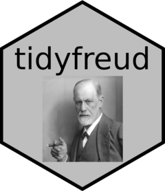

# tidyfreud 

tidyfreud contains the complete work of Sigmund Freud in a tidy format,
e.g. ready for NLP tasks.

## Installation

You can install the development version of tidyfreud from
[GitHub](https://github.com/) with:

``` r
# install.packages("devtools")
devtools::install_github("gygl/tidyfreud")
```

## Reproduction of text preparation

The source of the data is a
[PDF](https://www.valas.fr/IMG/pdf/Freud_Complete_Works.pdf) that
contains Freud’s complete work and that was downloaded from the
following website: <https://www.valas.fr/?lang=fr>. To reproduce the
data preparation clone locally the repository:

`git clone git@github.com:gygl/tidyfreud.git`

and open the folder as an RStudio project. Then download the file
`Freud_Complete_Works.pdf` and move it to `./data`. You can then run the
whole preprocessing steps by running the following command:

``` r
targets::tar_make()
```

All the pre-processing steps are done via the function:

``` r
create_sfreud_complete_work_tibble(path_pdf = "./data/Freud_Complete_Works.pdf")
```

that takes as argument `path_pdf` the path of the pdf file.

The main processing steps are:

- import in R of the text and table of content contained in the PDF
- tokenization of the text in lines/words
- detection of the book/article titles and subtitles
